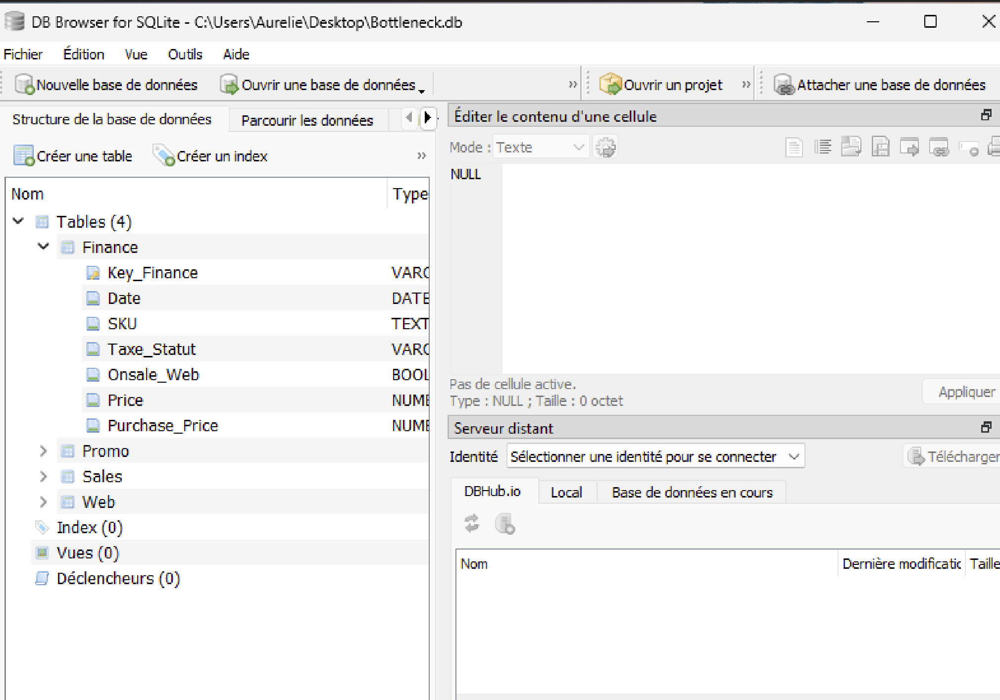
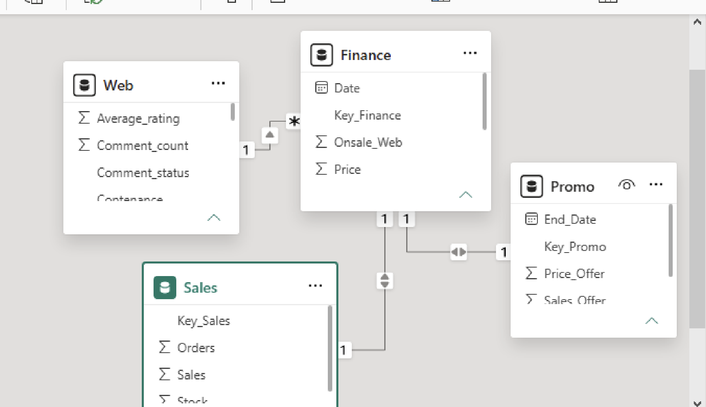
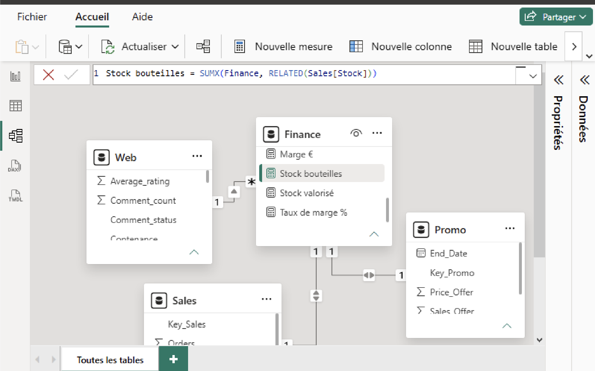
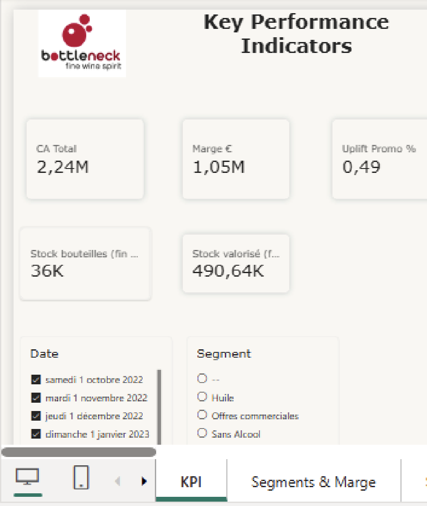
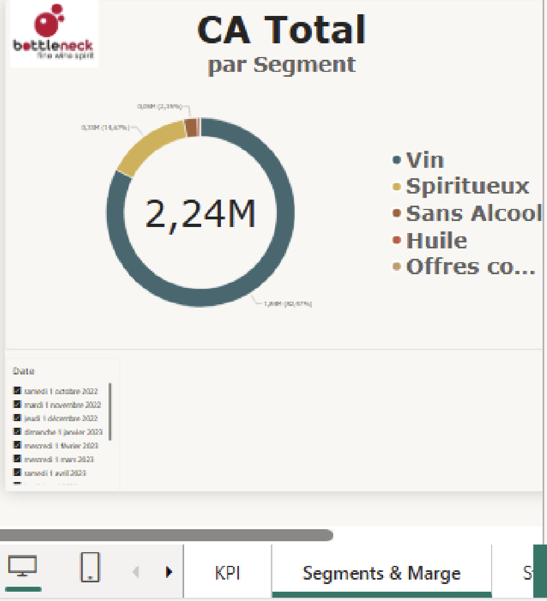
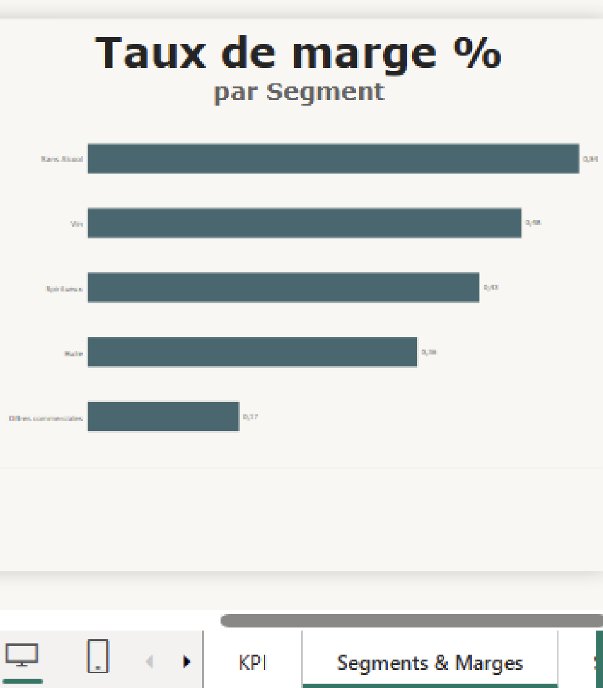
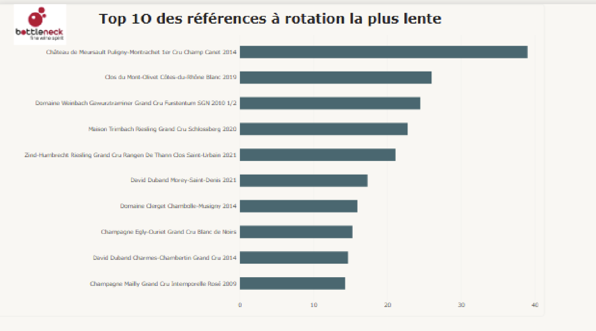
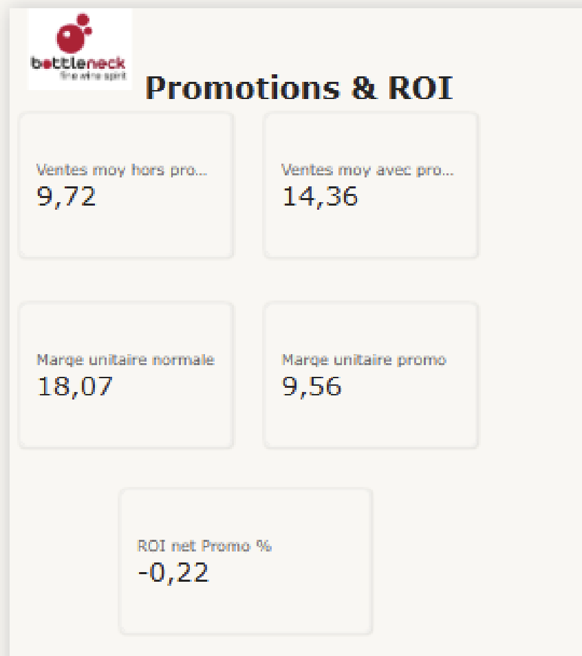

# Bottleneck — Tableau de bord Ventes & Stock (Power BI)

Projet 9 du parcours **Business Intelligence Analyst** (OpenClassrooms) : mise à disposition des données de vente d'un négociant en vins et spiritueux fictif (*Bottleneck*) dans un outil de data visualisation, pour un pilotage autonome de l'activité par la direction et les chefs de produits.

> Étude de cas pédagogique — les données (Bottleneck) sont fictives.

## Contexte

Bottleneck avait déjà centralisé ses données de vente, finance, promotions et web dans une base unique après un précédent chantier de fiabilisation. Il restait à les rendre exploitables au quotidien par des profils non techniques (PDG, chefs de produits), sans dépendre d'exports ponctuels.

**Mission :**
1. Choisir et justifier une méthode d'extraction et de traitement des données adaptée
2. Construire un tableau de bord Power BI répondant aux problématiques business de l'entreprise
3. En tirer des recommandations concrètes

## Méthodologie

Trois solutions d'extraction ont été comparées (connexion directe, extraction CSV manuelle, ETL intégré) — voir le rapport d'analyse complet dans `/docs`. **Power Query** (intégré à Power BI) a été retenu : les règles de nettoyage et de jointure sont paramétrées une fois et rejouées automatiquement à chaque actualisation, sans reprise manuelle.

Traitements appliqués automatiquement à chaque actualisation :
- Conversion des champs monétaires (texte à virgule → nombre)
- Neutralisation des valeurs vides avant agrégation
- Harmonisation du typage de la clé produit (SKU) entre les tables
- Jointure des quatre tables sources en un modèle unique
- Contrôle automatique du nombre de lignes attendu après jointure



## Modèle de données

Schéma en étoile autour d'une clé pivot (`Key_Finance`, qui combine l'année-mois et la référence produit) reliant les tables **Sales**, **Finance** et **Promo** ; la table **Web** (fiche produit, non temporelle) est reliée par le **SKU** seul.



Exemple de mesure DAX construite pour le suivi du stock :



## Le tableau de bord

### Vue d'ensemble — KPI

Chiffre d'affaires, marge, valeur du stock immobilisé et alerte sur les références sans fiche produit, avec filtres croisés par période et par segment.



### Segments & marge

Le Vin porte l'essentiel du chiffre d'affaires (82%), mais le Sans Alcool ressort premier en taux de marge (54%) — un signal de rentabilité qui ne suit pas le volume de ventes.




### Stock — rotation lente

Une dizaine de références (essentiellement des grands crus de garde) immobilisent l'essentiel de la valeur de stock : 36 316 bouteilles pour 490 637 € au prix d'achat.



### Promotions & ROI

Les promotions augmentent le volume vendu de +60% en moyenne, mais la marge unitaire est quasiment divisée par deux — le ROI net sur la marge ressort légèrement négatif (-22%).



## Recommandations business

1. **Statuer sur les 110 références sans fiche web** — choix éditorial (publication ou déréférencement), pas une urgence commerciale.
2. **Cibler la promotion plutôt que la généraliser** — la réserver aux segments à forte marge et au stock réellement dormant.
3. **Distinguer stock de garde assumé et stock dormant subi** — arbitrage cave par cave plutôt qu'une règle automatique.

## Contenu du dépôt

```
├── README.md
├── Dupassieux_Aurelie_2_tableau_092026.pbix   # tableau de bord Power BI
├── docs/
│   └── Dupassieux_Aurelie_Rapport_Etape1_P9.pdf  # rapport d'analyse (méthodologie)
└── assets/                                     # captures d'écran utilisées ci-dessus
```

## Reproduire ce projet

Le fichier `.pbix` s'ouvre avec [Power BI Desktop](https://powerbi.microsoft.com/desktop/) (gratuit). Toute chaîne de connexion à une base de données a été retirée avant publication ; l'actualisation nécessite de reconnecter le fichier à une source de données (export SQLite fourni dans le cadre de l'exercice, non inclus ici).

## Compétences mobilisées

Power BI · Power Query (ETL) · DAX · modélisation de données (schéma en étoile) · analyse business & storytelling data
